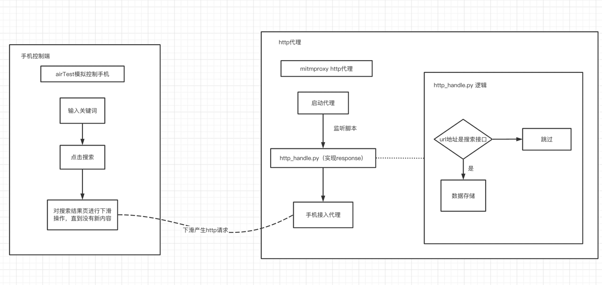

## 小红书app爬虫实现

### 一、整体思路图

#### 手机控制端
通过airTestIDE连接手机，生成poco树后就可识别出小红书上的搜索框以及按钮节点，参考auto_swiper.py
[airtest连接安卓手机教程](https://airtest.doc.io.netease.com/tutorial/4_Android_automated_testing_one/)

通过执行auto_swpier.py，实现自动搜索、下滑获取下一页等操作

#### http代理端
使用mitmproxy开启http代理，同时监听`http_handle.py`，手机接入代理后产生的http请求都会经过会`http_handle.py`进行处理

mitmproxy启动命令参考 `mitmweb -s http_handle.py -p 8085`

[mitmproxy官方文档](https://docs.mitmproxy.org/stable/)

